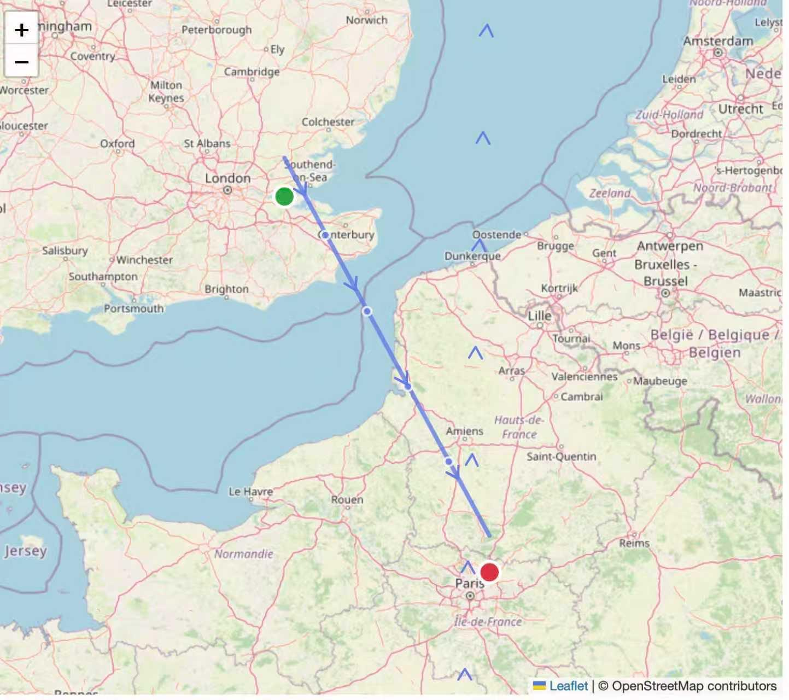
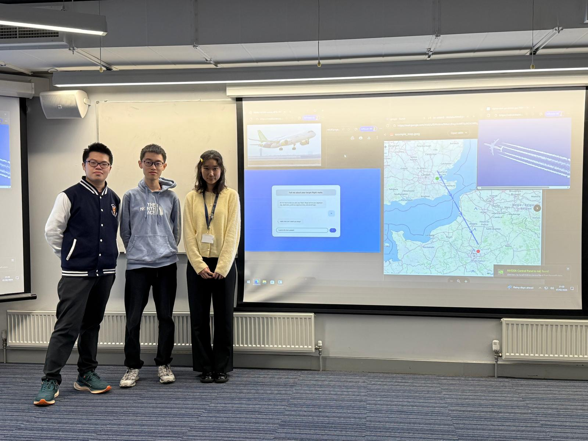

# Verifiable Contrail Optimisation

## Introduction

Aircraft condensation trails (contrails) contribute a substantial fraction of aviation’s overall climate impact, often exceeding that of CO₂ on relevant timescales. Importantly, contrail formation and its resulting energy forcing (EF) depend sensitively on local atmospheric conditions and can therefore be mitigated through intelligent flight planning that avoids contrail-prone regions.

Existing contrail-avoidance research has largely relied on the *polygon method*, in which airspace is separated into “contrail-forming” and “non-contrail-forming” regions. While computationally convenient, this binary classification fails to capture the inherently continuous nature of contrail energy forcing, as the climate impact of a contrail varies smoothly with atmospheric state rather than switching on or off at a fixed boundary.

Our project directly addresses this limitation by modelling contrail impact as a **continuous energy-forcing (EF) penalty field** over airspace. Instead of avoiding hard-coded polygons, we assign each region a real-valued EF penalty and compute optimal flight trajectories by minimising a combined objective:

Total cost = fuel burn + λ · EF_contrail

where λ controls the trade-off between operational efficiency and climate impact. By optimising over the entire route, our approach enables smooth, physically grounded trade-offs between fuel cost and contrail mitigation, yielding routes that are both operationally realistic and climate-aware.

Finally, the energy forcing values associated with the resulting routes can be independently verified using **Flare’s FDC (Flare Data Connector)**. By attesting contrail EF values to externally attested meteorological and climate data, this provides a transparent and verifiable pathway for validating the climate impact of optimised flight trajectories.

## Link to Demo Video

https://youtu.be/dUVVDJaQxLQ

## Method

Our pipeline has four main components: (1) a route-optimisation API, (2) a natural-language interface (RAG) for extracting flight intent, (3) a map-based visualisation of the computed route, and (4) on-chain verification of the route’s EF outputs using Flare FDC.

### 1) Route Optimisation API (FastAPI on Railway)

We host a FastAPI service on Railway that takes a flight request (start/end coordinates, departure time, duration, grid density, and a trade-off parameter λ) and returns a climate-aware route.

**Core idea.** We turn the region between origin and destination into a 2D grid of candidate waypoints and connect successive “columns” of waypoints to form a directed acyclic graph. Each edge represents a short flight segment between two candidate waypoints.

For each candidate segment, we estimate contrail **energy forcing (EF)** using `pycontrails` with **ERA5** meteorology and the **CoCiP** contrail model. We then run Dijkstra’s algorithm to minimise a combined objective:

Fuel cost (distance-proportional) + λ · EF_contrail

**Endpoints**
- `POST /optimum_ef_route`: returns the route as an ordered list of waypoint coordinates plus the total cost.
- `POST /optimum_ef_route_onchain`: returns integer-scaled outputs suitable for Solidity/on-chain verification workflows.

**Hosted API docs**
- https://testfastapi-production-325b.up.railway.app/docs
- https://github.com/ShizheL/testFastAPI/

### 2) Natural-language flight requests via RAG

To support casual human-computer interaction, we use a Retrieval-Augmented Generation (RAG) layer to interpret user natural language requests and extract the structured fields needed by the API. For example, a user can describe a flight in plain English (e.g., “tomorrow morning from London to Munich, prioritise lower climate impact”) and the RAG layer produces a validated `FlightData` payload (coordinates, time window, λ, etc.) which is then sent to the optimiser.

### 3) Route visualisation on a map

We plot the route on a map and this makes the fuel–climate trade-off controlled by λ interpretable. Here is an example for a flight between London and Paris.



### 4) Verifiable EF outputs with Flare FDC

To make the climate-impact outputs auditable, we provide an optional verification path using **Flare Data Connector (FDC)**. The optimiser exposes an on-chain-friendly endpoint (`/optimum_ef_route_onchain`) that returns integer-scaled values. These can be posted and verified via an example Hardhat workflow, demonstrating how EF-related route metrics can be anchored to externally attested data on Flare.

**Verification steps (Hardhat + Flare starter)**

```bash
git clone https://github.com/flare-foundation/flare-hardhat-starter.git

mv testContract.sol /flare-hardhat-starter/contracts/fdcExample
mv testContract.ts /flare-hardhat-starter/scripts/fdcExample

cd flare-hardhat-starter
yarn
cp .env.example .env

yarn hardhat run scripts/fdcExample/testContract.ts --network coston2
```

Here is an example of a verification on a flight segment:


## Execution

```bash
pip install react-leaflet leaflet
uvicorn main:app --reload --port 8000
```

## Our experience with Flare

Working with Flare during the hackathon was a great experience. The Flare team were highly responsive and supportive throughout the hackathon, particularly when we encountered infrastructure issues beyond our control. In one instance, the Data Availability (DA) layer link for the Coston2 network was temporarily broken; despite this, the team provided timely guidance and workarounds that allowed us to continue testing and validating our code.

Overall, we really enjoyed our time working with Flare at the ETH Oxford Hackathon.


